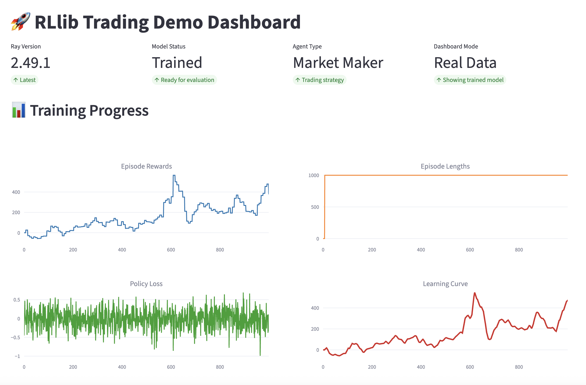

# 🏟️ RLlib Trading Arena

A comprehensive trading arena showcasing RLlib's latest capabilities. Train and evaluate trading strategies in realistic financial markets using Ray 2.49.1.

## 🚀 Features

- **Trading Environment**: Realistic order book simulation with market dynamics
- **Distributed Training**: Leverages Ray's distributed computing for scalable RL training
- **Algorithm Support**: PPO with Ray 2.49.1's new API stack
- **Interactive Dashboard**: Training metrics and progress charts
- **Cloud Ready**: Optimized for cloud deployment and scaling

## 🏗️ Architecture

```
├── environments/          # Trading environment implementations
├── agents/               # Agent-specific configurations and policies
├── training/             # Training scripts and CLI
├── dashboard/            # Interactive monitoring dashboard
└── configs/              # Configuration files
```

## ⚡ Quick Start (5 Minutes)

### 1. Install Dependencies
```bash
# Install uv if you haven't already
curl -LsSf https://astral.sh/uv/install.sh | sh

# Install project dependencies
uv sync
```

### 2. Train & Evaluate
```bash
# Train a trading agent
uv run rllib-trading-arena train --iterations 100

# Evaluate the trained model
uv run rllib-trading-arena evaluate --episodes 5

# View results in dashboard
uv run trading-dashboard
```

## 🎯 Complete Demo (15 Minutes)

### Step 1: Train the Agent
```bash
# Start training (this will take 5-10 minutes)
uv run rllib-trading-arena train --iterations 100

# Watch the training progress in your terminal
# The agent will learn to make trading decisions
```

### Step 2: Evaluate Performance
```bash
# Test the trained agent
uv run rllib-trading-arena evaluate --episodes 5

# This will show you how well the agent performs
# Look for positive P&L and reasonable trading activity
```

### Step 3: View Results in Dashboard
```bash
# Launch the interactive dashboard
uv run trading-dashboard

# Open your browser to http://localhost:8501
# View training metrics and progress charts
```

## 🎛️ Configuration

The demo uses `configs/trading_config.yaml` for all settings:

### Market Parameters
```yaml
market:
  initial_price: 100.0
  volatility: 0.02
  max_steps_per_episode: 128
  tick_size: 0.01
```

### Training Parameters
```yaml
training:
  lr: 0.0003
  train_batch_size: 256
  gamma: 0.99
  entropy_coeff: 0.01
```

### Distributed Training
```yaml
distributed:
  num_workers: 4
  num_cpus_per_worker: 1
  num_gpus: 0
```

## 📊 Dashboard Screenshots

### Training Progress


### Training Performance


### Evaluation Results


### Evaluation Episodes


## 📈 Understanding the Results

### Key Metrics to Watch
- **Episode Reward**: Should increase over time (learning)
- **Episode Length**: Should stabilize around 128 steps
- **Policy Loss**: Should decrease (better decision making)
- **P&L**: Should be positive in evaluation (profitable trading)

### What Good Performance Looks Like
- **Training**: Episode rewards trending upward
- **Evaluation**: Positive P&L, reasonable trade frequency
- **Stability**: Consistent performance across episodes
- **Learning**: Clear improvement from random to strategic behavior

## ⚠️ Single-Stock Environment

This demo uses a **single stock** for simplicity. The agent trades one asset (no stock symbols or diversification). This keeps the demo focused and easy to understand, but in real trading you'd typically want multiple assets for portfolio diversification.

## 🎯 What the Agent Can Learn

### ✅ Learnable Trading Patterns
- **Mean Reversion**: Buy low, sell high when prices deviate from trend
- **Event-Based Trading**: React to market events (crashes, rallies)
- **Risk Management**: Control position sizes and stop losses
- **Market Making**: Provide liquidity and capture spreads
- **Timing**: When to enter/exit positions

### ❌ Limitations (Not Learnable)
- **Fundamental Analysis**: No company financials or news
- **Cross-Asset Relationships**: Only single stock trading
- **Market Microstructure**: Simplified order book
- **External Factors**: No economic indicators or sentiment
- **Competition**: No other agents in the market

## 🔧 Advanced Usage

### CLI Commands
```bash
# Training options
uv run rllib-trading-arena train --iterations 200 --checkpoint-dir custom_path
uv run rllib-trading-arena demo --iterations 10 --render

# Evaluation options
uv run rllib-trading-arena evaluate --episodes 10 --render

# Dashboard options
uv run trading-dashboard --port 8502
```

### Customizing Training Parameters
```yaml
# configs/trading_config.yaml
training:
  lr: 0.0001  # Lower learning rate for stability
  train_batch_size: 512  # Larger batches for better gradients
  gamma: 0.95  # Shorter time horizon
  entropy_coeff: 0.05  # More exploration
```

### Environment Customization
```python
# Modify environments/trading_environment.py
# - Adjust reward function
# - Change observation space
# - Add new market dynamics
```

## 🐛 Troubleshooting

### Common Issues
- **Low Episode Rewards**: Try increasing learning rate or training iterations
- **High Policy Loss**: Reduce learning rate or increase batch size
- **No Learning**: Check if rewards are properly scaled
- **Memory Issues**: Reduce batch size or number of workers
- **Slow Training**: Increase number of workers or use GPU

### Performance Optimization
- **Batch Size**: Start with 256, adjust based on memory
- **Workers**: Use 4-8 workers for good performance
- **Learning Rate**: 0.0003 works well for most cases
- **Episode Length**: 128 steps provides good balance

## 📚 Learning Resources

### RLlib Documentation
- [RLlib Overview](https://docs.ray.io/en/latest/rllib/index.html)
- [PPO Algorithm](https://docs.ray.io/en/latest/rllib/algorithms/ppo.html)
- [Environment API](https://docs.ray.io/en/latest/rllib/rllib-env.html)

### Ray Documentation
- [Ray Core](https://docs.ray.io/en/latest/ray-core/walkthrough.html)
- [Distributed Training](https://docs.ray.io/en/latest/ray-core/actors.html)

### Distributed Training Resources
- [Ray Cluster Setup](https://docs.ray.io/en/latest/cluster/getting-started.html)
- [Performance Tuning](https://docs.ray.io/en/latest/ray-core/performance-tips.html)

## 🎉 Next Steps

### Extend the Demo
- **Multi-Asset Trading**: Add more stocks to the environment
- **Advanced Agents**: Implement momentum and arbitrage strategies
- **Real Data**: Connect to live market data feeds
- **Risk Management**: Add portfolio-level risk controls

### Production Deployment
- **Model Serving**: Deploy trained models to production
- **Real-Time Trading**: Connect to live trading systems
- **Monitoring**: Set up comprehensive monitoring and alerting
- **Backtesting**: Implement robust backtesting frameworks

## ☁️ Cloud Deployment

### TODO: Cloud Deployment Options
- [ ] **AWS/GCP/Azure**: Configure distributed training on cloud instances
- [ ] **Ray Cluster**: Set up multi-node Ray clusters for scaling
- [ ] **Container Deployment**: Docker/Kubernetes deployment options
- [ ] **Cost Optimization**: Resource management and auto-scaling
- [ ] **Monitoring**: Cloud-native monitoring and alerting setup

## 📄 License

This project is licensed under the MIT License - see the [LICENSE](LICENSE) file for details.